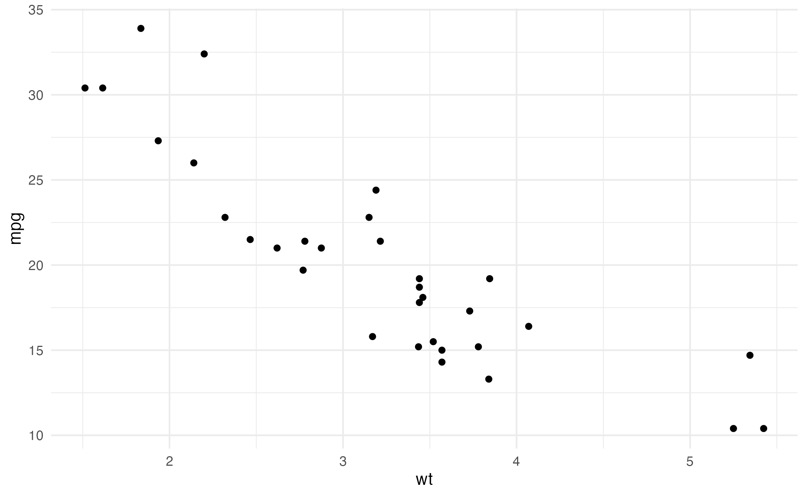

```{r, include = FALSE}
knitr::opts_chunk$set(
  collapse = TRUE,
  comment = "#>"
)
```

```{r setup, message=FALSE, warning=FALSE}
library(qtkit)
library(ggplot2)
library(dplyr)
library(knitr)
library(kableExtra)
```

# Introduction

The {qtkit} package provides several functions to help publish analysis artifacts in a standardized way:

- `write_kbl()`: Save kable/kableExtra tables to files
- `write_gg()`: Save ggplot2 plots to files
- `write_obj()`: Save R objects to files

These functions handle common tasks like:

- Automatic file naming based on code chunk labels
- Directory creation
- Multiple output formats
- Consistent styling and theming

# Writing Tables

## Basic Table Export

Let's create and save a simple table using `write_kbl()`:

```{r mtcars_table}
# Create a basic table
mtcars_table <- mtcars[1:5, 1:4] |>
  kable(format = "html") |>
  kable_styling(bootstrap_options = "striped")

# Save to file
write_kbl(
  kbl_obj = mtcars_table,
  file = "mtcars_table",
  target_dir = "artifacts/",
  device = "png"
)
```

## Customizing Table Output

You can customize the output format and styling:

```{r mtcars_table_styled}
mtcars_table <- mtcars[1:5, 1:4] |>
  kable(format = "html") |>
  kable_styling(
    bootstrap_options = c("striped", "hover"),
    full_width = FALSE
  ) |>
  row_spec(0, bold = TRUE)

write_kbl(
  kbl_obj = mtcars_table,
  file = "mtcars_styled",
  target_dir = "artifacts/",
  device = "png",
  bs_theme = "flatly"
)
```

# Writing Plots

## Basic Plot Export

Save ggplot2 plots with `write_gg()`:

```{r mtcars_plot}
# Create a basic plot
p <- ggplot(mtcars, aes(wt, mpg)) +
  geom_point() +
  theme_minimal()

# Save to file
write_gg(
  gg_obj = p,
  file = "mtcars_plot",
  target_dir = "artifacts/",
  device = "png"
)
```

## Customizing Plot Output

Add custom themes and formatting:

```{r mtcars_plot_styled}
p <- ggplot(mtcars, aes(wt, mpg, color = factor(cyl))) +
  geom_point(size = 3) +
  theme_minimal() +
  labs(
    title = "Car Weight vs Fuel Efficiency",
    x = "Weight (1000 lbs)",
    y = "Miles per Gallon",
    color = "Cylinders"
  )

write_gg(
  gg_obj = p,
  file = "mtcars_plot_styled",
  target_dir = "artifacts/",
  device = "png",
  width = 8,
  height = 6,
  dpi = 300
)
```

# Writing R Objects

## Saving Data Objects

Use `write_obj()` to save R objects for later use:

```{r mtcars_subset}
# Create a filtered dataset
mtcars_subset <- mtcars |>
  filter(cyl == 4) |>
  select(mpg, wt, hp)

# Save to file
write_obj(
  obj = mtcars_subset,
  file = "mtcars_4cyl",
  target_dir = "artifacts/"
)
```

## Reading Saved Artifacts

These objects have all been saved in the `artifacts` directory, as seen below:

```{r artifacts_list}
fs::dir_tree("artifacts")
```

Tables and plots saved with {qtkit} can be easily restored. For image formats, you can use the `knitr::include_graphics()` function, markdown, or HTML:

```r

```

```md

```


```html

```

Objects can be read back using `dget()`:

```{r mtcars_subset_restore}
# Read the saved object
restored_data <- dget("artifacts/mtcars_4cyl")

# Check the restored object
glimpse(restored_data)
```

> **Tip**
> Note that tables and plots need not be saved with the `write_kbl()` and `write_gg()` functions to be restored. These objects can be saved and restored using the `write_obj()` and `dget()` function as well.


# Best Practices

1. Use consistent naming conventions
2. Create organized directory structures
3. Document output formats and locations
4. Include version control for outputs when appropriate
5. Validate restored objects match originals

# Additional Resources

- Package documentation: `help(package = "qtkit")`
- Related packages: {kableExtra}, {ggplot2}, {webshot2}
- [Project homepage](https://github.com/qtalr/qtkit)


